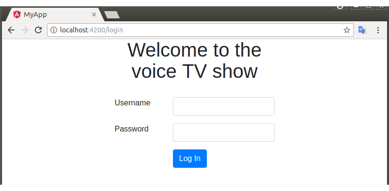
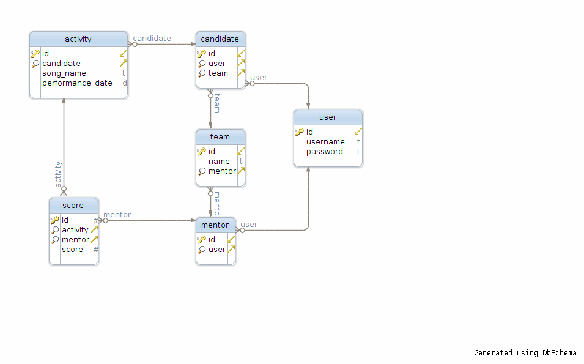

# The Voice TV show management system

Previous all pages are integrated into the Django code using Django Template System. The front end is being rewritten using Angular 4. The front end will call the restful API in backend to get the data.

* [ ] Log in
  * [x] Frontend
  * [ ] Backend Restful API
*[ ] Admin view
  *[ ] Frontend
  *[ ] Backend Restful API
*[ ] Mentor view
  *[ ] Frontend
  *[ ] Backend Restful API
  

## Run it in development environment

* Backend: The backend is written in Python/Django. You need enter into the /src/backend directory to run commands which related to the backend.
  
  - First, you need create your own python 3.5 virtual environment and install the required python modules in requirements.txt.

  - Second, run the command to create the database table.
  ```sh
  python manage.py migrate
  ```
  - Third, run the management commands to create some fakes users/activities/scores.
  ```sh
  python managy.py create_voice_admin -h
  python managy.py create_voice_mentor -h
  python managy.py create_voice_candidate -h
  python managy.py create_voice_team -h
  python managy.py create_voice_activity -h
  python managy.py create_voice_score -h
  ```
  
  - Lastly, start the development backend server.
  ```sh
  python management.py runserver
  ```

* Frontend: the front end is written in Angular 4.
 
  - First to install the necessary javascript modules using npm.
  ```sh
  npm install
  ```
  
  - After you start the backend server, you can run the following command to start the frontend development server.

  ```
  npm start
  ```

  Now, you can enter the url (see below for all possible urls) in your favorite browser. For example: http://localhost:4200/login to log into the system.
  


## Backend models


* three kinds of users
    - candidate: inherited from Django User model, and has a many-to-one relationship with Team model, has one-to-many relationship with Activity model
    - mentor: inherited from Django User Model, and has a many-to-many relationship with Activity model
    - admin: shared with Django User Model whose is_superuser attribute is set to True

### commands to create backend models
```sh
python managy.py create_voice_admin -h
python managy.py create_voice_mentor -h
python managy.py create_voice_candidate -h
python managy.py create_voice_team -h
python managy.py create_voice_activity -h
python managy.py create_voice_score -h
```
## All URLs
* /, this will redirect to /score/login/.
* /score/login/, user login page. Candidate could not login because they are not active in Djanog User model.
* /score/logout/, after logout, redirect to /score/login/ page.
* /score/candidate/<candidate_id>/, this page list all of activities of the candidate, his average_score and the team average_score.
* /score/team/<team_id>/, this page list all of candidates and their average_score in the team.
* /score/mentor/, this page list all of mentor's team and the candidates in each team.
* /score/admin/, this page list all teams and the corresponding team's average score.
* /score/, this will redirect to /score/admin/ or /score/mentor according to the logged user information.
